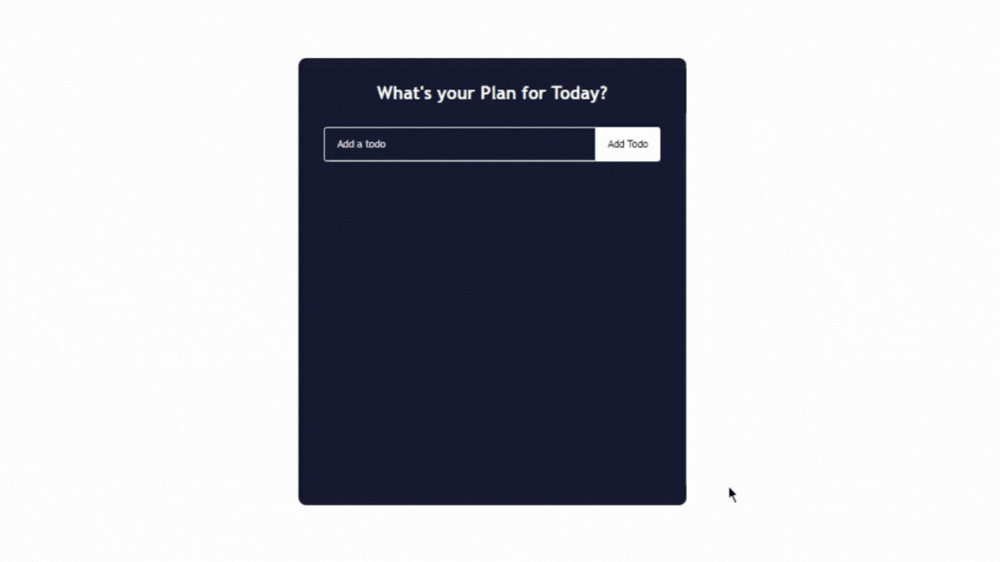

# Todo App

This is a simple todo application built with React.

## Features

- Add new todo items
- Mark todo items as completed
- Remove todo items
- Edit todo items (coming soon)

## Usage

1. Enter a todo item in the input field.
2. Press Enter or click the "Add Todo" button to add the todo item.
3. Click on a todo item to mark it as completed.
4. Hover over a todo item to reveal delete and edit icons.
5. Click the delete icon to remove a todo item.

## Contributing

Contributions are welcome! Please create a pull request or open an issue if you encounter any problems or have suggestions for improvement.

